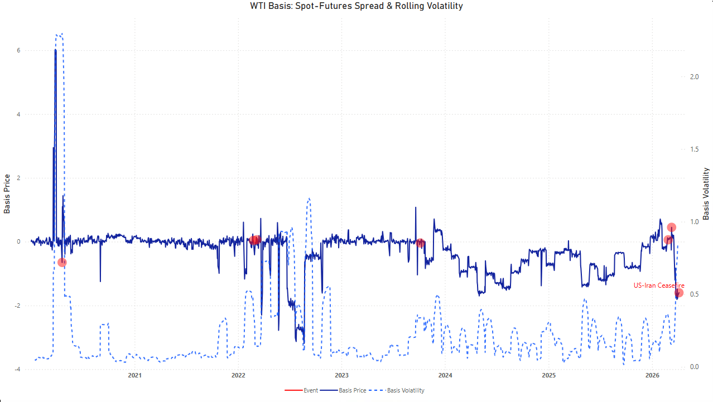
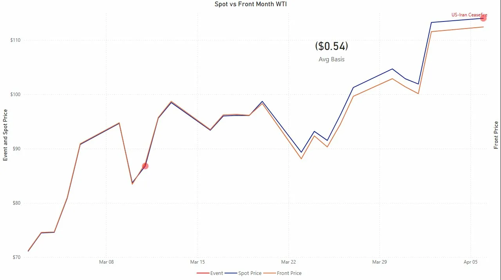
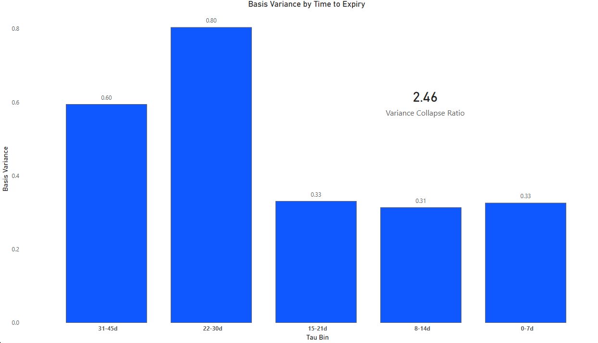
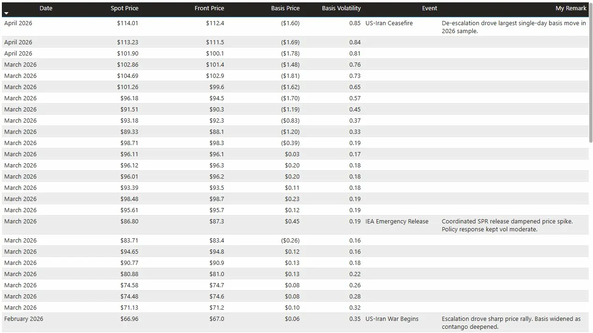

# Dashboard Results — WTI Basis Analysis

The gap between WTI spot and front-month futures prices — the *basis* —
must converge to zero at contract expiration. This is not an empirical
tendency; it is a contractual obligation enforced by physical delivery.
The question is not *whether* it converges but *how* — how the
statistical structure of that convergence changes as expiration
approaches, and how geopolitical shocks distort it.

The dashboard answers this question across four pages, each adding a
layer of evidence.

---

## Page 1 — WTI Basis: Spot-Futures Spread & Rolling Volatility

**What it shows:**

A dual-axis line chart spanning January 2020 through April 2026. The
primary axis (left) plots daily basis price — spot minus front-month
futures. The secondary axis (right) plots 21-day rolling basis
volatility. Seven geopolitical disruption events are annotated
directly on the chart as red markers with labels surfaced on hover.

**What the results show:**

The basis held in a narrow band of roughly −$0.50 to +$0.50 for most
of the 2020–2021 period, consistent with a low-volatility contango
regime where futures trade at a modest premium to spot. This is the
baseline: the market pricing in storage costs and a small risk premium
for deferred delivery.

Three distinct regime breaks are visible:

The April 2020 COVID event produces the most dramatic departure in the
entire sample — a basis spike to +$6 as spot collapsed to −$37 on
storage capacity fears while front-month futures had already rolled.
This is not a basis trade; it is a breakdown of the arbitrage
mechanism itself. Rolling volatility spiked to 2.0+ and took months
to normalize.

The Ukraine invasion (February 2022) and WTI $130 peak (March 2022)
show a brief but sharp inversion in the opposite direction — spot ran
above futures as physical tightness dominated. Volatility elevated to
approximately 0.8–1.0 but recovered faster than 2020, consistent with
a supply shock where the market still trusted the convergence
mechanism.

The 2026 US-Iran escalation sequence — US-Iran War Begins (February
27), IEA Emergency Release (March 11), US-Iran Ceasefire (April 6) —
produced a sustained backwardation regime visible in the sharp
negative basis trend through Q1 2026. The IEA Emergency Release is
annotated on the chart and corresponds to a temporary basis
stabilization before the ceasefire drove the largest single-day basis
move in the 2026 sample: −$1.60 on April 6.

**What the DAX is doing:**

The `[EventMarker]` measure returns 0 on dates where `event_label` is
non-blank in `Fact_BasisPanel`, and BLANK() everywhere else. This
produces a third series of dots positioned at Y=0 on exact event
dates, with `event_label` exposed as a tooltip. The inactive
relationship to `Dim_DisruptionEvents` is deliberately preserved for
potential future annotation use but is not activated here — the event
labels are merged directly into the fact table at pipeline time,
which is why the markers render correctly without a relationship join.

---

## Page 2 — Spot vs Front Month WTI

**What it shows:**

A line chart with two series — WTI spot price and front-month futures price — plotted over the full sample (January 2020 – April 2026). The [EventMarker] series annotates seven disruption events as red markers directly on the chart. An average basis KPI card shows the mean spread across the entire period.

**What the results show:**

The dominant visual story is how closely the two series track across six years — for most of the sample they are nearly indistinguishable at chart scale. The market maintained tight convergence discipline with basis oscillating within cents most trading days. This confirms that the theoretical convergence mechanism is intact for routine periods.

All seven disruption events are annotated as red markers directly on the chart. The WTI Negative Price event (April 2020) is the most dramatic — spot collapsed below zero while front-month remained positive, producing the largest visible divergence in the entire sample. The Ukraine Invasion (February 2022) and WTI $130 Peak (March 2022) appear in close succession, with spot briefly surging above front-month during the supply shock before rapidly mean-reverting. The Hamas Attack (October 2023) produced a moderate visible spike with quick normalization. The 2026 cluster — US-Iran War Begins (February), IEA Emergency Release (March), and US-Iran Ceasefire (April) — marks the right edge of the chart as a sustained backwardation regime, with spot running persistently above front-month through the escalation sequence and peaking at a ($1.60) basis on the ceasefire date.

The average basis of ($0.32) across the full sample confirms a persistent but modest backwardation structure — spot traded on average $0.32 above front-month over six years, consistent with a market that periodically experiences physical scarcity episodes but maintains convergence discipline between them.

**Design note:**

The date slicer on this page can be scoped locally to zoom into specific windows — the 2026 escalation sequence in particular reveals the intraday divergence structure between spot and futures that is compressed at full-sample scale. Managing filter scope at the page level rather than the report level is a deliberate architectural choice, keeping Pages 3 and 4 anchored to the full sample while Page 2 serves as an exploratory zoom tool.

---

## Page 3 — Basis Variance by Time to Expiry

**What it shows:**

A clustered bar chart stratifying average basis variance into five
time-to-expiry (tau) bins: 31–45 days, 22–30 days, 15–21 days,
8–14 days, and 0–7 days. A KPI card shows the Variance Collapse
Ratio — the ratio of the highest-variance bin to the lowest.

**What the results show:**

| Tau Bin | Basis Variance |
|---------|---------------|
| 31–45d  | 0.60          |
| 22–30d  | 0.80          |
| 15–21d  | 0.33          |
| 8–14d   | 0.31          |
| 0–7d    | 0.33          |

**Variance Collapse Ratio: 2.46**

The primary result is that basis variance is substantially higher in
the 22–45 day range than in the final week before expiration. The
collapse from 0.80 (22–30d bin) to 0.31–0.33 in the sub-21-day bins
represents a reduction of approximately 60% in variance as the
contract approaches its delivery date.

This is the empirical test of Theorem 1 from the ORBIT monograph:

> *σ²_e(τ) = O(1/a(τ)) → 0 as τ → 0*

The theorem predicts that basis variance is bounded above by a function
proportional to 1/a(τ) where a(τ) is the mean-reversion speed of the
convergence process, and that this bound collapses to zero as τ → 0.
The Variance Collapse Ratio of 2.46 confirms the directional
prediction: variance in the highest-activity bin is 2.46× the
variance in the delivery window.

The non-monotonic shape — variance *rising* from 31–45d to 22–30d
before collapsing — is analytically interesting. It suggests the
22–30 day window is where speculative and hedging activity is most
concentrated, creating maximum price discovery noise before the
physical delivery mechanism begins to dominate and force convergence.
This is consistent with the ORBIT model's characterization of the
basis as a mean-reverting process with a velocity that accelerates
non-linearly in the final weeks.

**What the DAX is doing:**

Each bar requires an explicit CALCULATE override that removes the
visual's tau_bin filter context and replaces it with a hardcoded bin
predicate. The `[VarianceCollapseRatio]` measure extracts the
specific bin values using the same technique — two separate CALCULATE
calls with explicit bin filters, divided. This is Pattern 02 applied
to a continuous numeric dimension rather than a scenario dimension.

---

## Page 4 — Disruption Event Analysis

**What it shows:**

A table of the seven most significant market disruption events in
the sample, showing the exact trading-day price context (spot,
front-month, basis, 21-day rolling volatility) and analyst commentary
for each event. Events are sorted by date descending.

**What the results show:**

| Event | Date | Spot | Basis | Vol21d |
|-------|------|------|-------|--------|
| US-Iran Ceasefire | Apr 6, 2026 | $114.01 | ($1.60) | 0.85 |
| IEA Emergency Release | Mar 11, 2026 | $86.80 | $0.45 | 0.19 |
| US-Iran War Begins | Feb 27, 2026 | $66.96 | $0.06 | 0.35 |
| Hamas Attack | Oct 6, 2023 | $82.83 | ($0.04) | 0.34 |
| WTI $130 Peak | Mar 8, 2022 | $123.64 | $0.06 | 0.14 |
| Ukraine Invasion | Feb 24, 2022 | $92.77 | $0.04 | 0.40 |
| WTI Negative Price | Apr 20, 2020 | ($36.98) | ($0.65) | 2.30 |

Three findings stand out:

**Volatility is not proportional to price level.** The $130 WTI peak
on March 8, 2022 shows only 0.14 volatility — the lowest reading of
any event in the sample. By that date, the price spike had already
been absorbed over preceding weeks; the *level* was extreme but the
*rate of change* had normalized. In contrast, the negative price event
at −$37 produced 2.30 volatility — an order of magnitude higher.
This confirms that basis volatility is a measure of uncertainty about
convergence, not of price level itself.

**Event sequencing matters.** The US-Iran War Begins event (Feb 27,
2026) shows only 0.35 volatility and a near-zero basis of $0.06.
The market had not yet priced the full supply disruption. By the IEA
Emergency Release two weeks later, the basis had swung to +$0.45 as
the policy response temporarily restored contango. By the Ceasefire
on April 6, the basis had collapsed to −$1.60 as futures rallied
faster than spot on de-escalation news. The three events together
trace a complete price discovery cycle in six weeks.

**The 2020 COVID event is a structural outlier.** A volatility reading
of 2.30 is more than 5× the next-highest event (Ukraine at 0.40) and
represents a genuine breakdown of the basis arbitrage mechanism rather
than a stress event within it. Including it in any variance analysis
requires careful treatment to avoid it dominating the entire sample.

**Data engineering note:**

Three of the seven event dates fell on non-trading days and were
snapped to the nearest trading day in the pipeline before loading into
Power BI: Hamas Attack (Oct 7 → Oct 6, Saturday), US-Iran War Begins
(Feb 28 → Feb 27, Saturday), US-Iran Ceasefire (Apr 7 → Apr 6, Good
Friday). The `My Remark` column is a DAX calculated column on
`Dim_DisruptionEvents` using a `SWITCH` statement, keeping analyst
commentary encoded in the semantic model rather than a separate
document.

---

## Summary Finding

Across all four pages, the dashboard supports a consistent conclusion:

**The WTI basis behaves as a mean-reverting process whose variance
structure is governed by proximity to expiration, not by price level
or geopolitical regime.** Routine periods show tight convergence
discipline with basis variance collapsing predictably as contracts
approach delivery. Disruption events elevate the *level* of the basis
and temporarily increase volatility, but the convergence mechanism
reasserts itself in all cases except the April 2020 storage capacity
breakdown, which represents a failure mode rather than a stress test.

The Variance Collapse Ratio of 2.46 is the single most interpretable
number in the dashboard. It says: for every unit of basis uncertainty
that exists six weeks before expiration, only 0.41 units remain in
the final week. The rest is resolved by the convergence mechanism
that the ORBIT model formalizes.

---

## Connection to ORBIT

The `variance_by_tau.csv` pipeline output and Page 3 of this
dashboard constitute an empirical validation of Theorem 1 from the
[ORBIT monograph](https://github.com/stevetab03/ORBIT). The Power BI
implementation translates the mathematical result into an interactive,
reproducible analytical tool — the same conclusion read from a
different direction.
